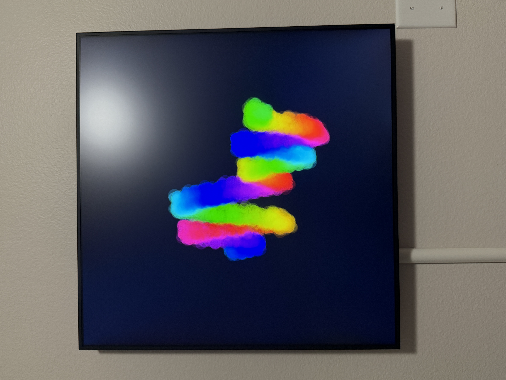

# Show us your frame

This is where community members share photos of their revived digital frames. Old hardware, new life.

To submit your own photo, add the image to `docs/gallery/`, add a row to the table below, and open a pull request. Include the frame model and a brief description of where it lives or what it's running.

| Photo | Frame | Owner | Description |
|-------|-------|-------|-------------|
|  | LAGO Genesis | [@jordanlyall](https://github.com/jordanlyall) | Office wall. Running Chromie Squiggles by Snowfro in dark theme. |
